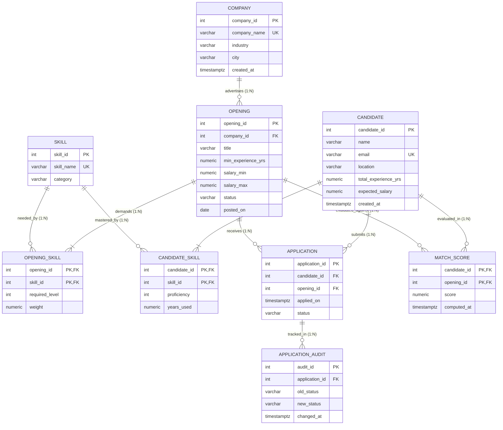

# Dev Job and Skill-Matching Platform

> An enterprise-grade PostgreSQL relational database system designed to quantify and automate recruitment matchmaking between software engineers and job vacancies using weighted skill algorithms.

---

## 🎯 Problem Statement

Traditional hiring pipelines often suffer from inefficient resume filtering and qualitative mismatching between candidate skill sets and job requirements. Keyword-based matching fails to consider candidate depth, proficiency levels, and the relative importance of specific technologies to a team. 

This platform addresses this challenge by implementing a normalized relational database engine in PostgreSQL that computes mathematical match compatibility scores (0.00% to 100.00%) between candidates and job openings, factoring in required skill proficiencies (1–5), hands-on experience, and custom requirement weights.

---

## ✨ Features

- **Algorithmic Match Scoring**: Computes weighted skill compatibility using normalized proficiency thresholds and requirement weightings:
  $$\text{Score} = 100 \times \frac{\sum \left(\text{weight} \times \min\left(\frac{\text{proficiency}}{\text{required\_level}}, 1\right)\right)}{\sum \text{weight}}$$
- **Real-Time Trigger Automation**:
  - Guard trigger preventing candidate applications to `CLOSED` job openings.
  - Automated status auditing (`application_audit`) on every application lifecycle change.
  - Dynamic `match_score` recalculation triggered upon changes to `candidate_skill` or `opening_skill`.
- **Atomic Hiring Workflows**: Stored procedure `hire_candidate()` executes candidate hiring, vacancy closure, and competing applicant rejections in a single transaction.
- **Role-Based Access Control (RBAC)**: Least-privilege security model with defined roles for `admin_role`, `recruiter_role`, and `candidate_role`.
- **Strict 3NF/BCNF Normalization**: Complete elimination of partial and transitive dependencies using dedicated junction entities (`candidate_skill`, `opening_skill`).

---

## 🛠️ Tech Stack

- **Database Engine**: PostgreSQL (v12+)
- **Procedural Language**: PL/pgSQL (Triggers, Stored Procedures, Functions)
- **Data Modeling & Architecture**: 3NF Relational Schema, B-Tree Indexing, POSIX Regex Constraints
- **Client Tools**: `psql` CLI, pgAdmin 4, DBeaver

---

## 📊 Entity-Relationship (ER) Diagram



*For comprehensive architecture and normalization details, see [ER Diagram Documentation](docs/er-diagram.md) and [Schema Design Analysis](docs/schema-design.md).*

---

## 🚀 How to Run

### 1. Initialize Database
Create a database named `devmatch` in PostgreSQL:
```bash
createdb -U postgres devmatch
```

### 2. Option A: Master Execution (Recommended)
Run the entire pipeline in sequence via the master orchestration script:
```bash
psql -U postgres -d devmatch -f sql/08_run_all.sql
```

### 3. Option B: Step-by-Step Execution
Run each module individually in exact numerical order:
```bash
psql -U postgres -d devmatch -f sql/01_schema.sql
psql -U postgres -d devmatch -f sql/02_sample_data.sql
psql -U postgres -d devmatch -f sql/03_views.sql
psql -U postgres -d devmatch -f sql/04_triggers.sql
psql -U postgres -d devmatch -f sql/05_procedures.sql
psql -U postgres -d devmatch -f sql/06_queries.sql
psql -U postgres -d devmatch -f sql/07_roles_access.sql
```

---

## 💡 Sample Queries & Usage

### 1. Retrieve Top 3 Ranked Candidates per Opening
```sql
WITH ranked_matches AS (
    SELECT 
        o.opening_id,
        o.title AS opening_title,
        comp.company_name,
        c.name AS candidate_name,
        ms.score,
        DENSE_RANK() OVER (PARTITION BY o.opening_id ORDER BY ms.score DESC, c.candidate_id ASC) AS rank_pos
    FROM opening o
    JOIN company comp ON o.company_id = comp.company_id
    JOIN v_match_scores ms ON o.opening_id = ms.opening_id
    JOIN candidate c ON ms.candidate_id = c.candidate_id
    WHERE o.status = 'OPEN'
)
SELECT opening_id, opening_title, company_name, rank_pos, candidate_name, score
FROM ranked_matches
WHERE rank_pos <= 3
ORDER BY opening_id, rank_pos;
```

### 2. Query Function for Top Candidate Matches
```sql
-- Fetch the top 5 matches for Opening 1:
SELECT candidate_name, score, candidate_rank
FROM get_top_candidates(1, 5);
```

### 3. Execute Transactional Hiring
```sql
-- Atomically hires Candidate for Application 1, closes vacancy, and rejects competing applicants:
CALL hire_candidate(1);
```

---

## 📂 Project Structure

```text
dev-job-matching-dbms/
├── docs/
│   ├── er-diagram.md          # Formal Mermaid ER model and entity dictionary
│   └── schema-design.md       # Table architecture and 1NF -> 2NF -> 3NF normalization proof
├── screenshots/               # Query execution results and psql outputs
├── sql/
│   ├── 01_schema.sql          # DDL: Tables, PK/FKs, cascade rules, checks, indexes
│   ├── 02_sample_data.sql     # DML: Realistic seed data with curated demo cases
│   ├── 03_views.sql           # Views: Match scoring formula, rankings, skill demand
│   ├── 04_triggers.sql        # Triggers: Closed-status guard, audit logger, live sync
│   ├── 05_procedures.sql      # Routines: get_top_candidates(), hire_candidate(), recompute
│   ├── 06_queries.sql         # 12 analytical queries (window functions, CTEs, EXISTS, HAVING)
│   ├── 07_roles_access.sql    # RBAC: admin_role, recruiter_role, candidate_role
│   └── 08_run_all.sql         # Master sequential deployment script (\i)
├── .gitignore                 # OS, IDE, and temporary file filters
└── README.md                  # Project overview and documentation
```

---

## 👤 Author

**Anushree R**  
*DBMS College Project — Dev Job and Skill-Matching Platform*
